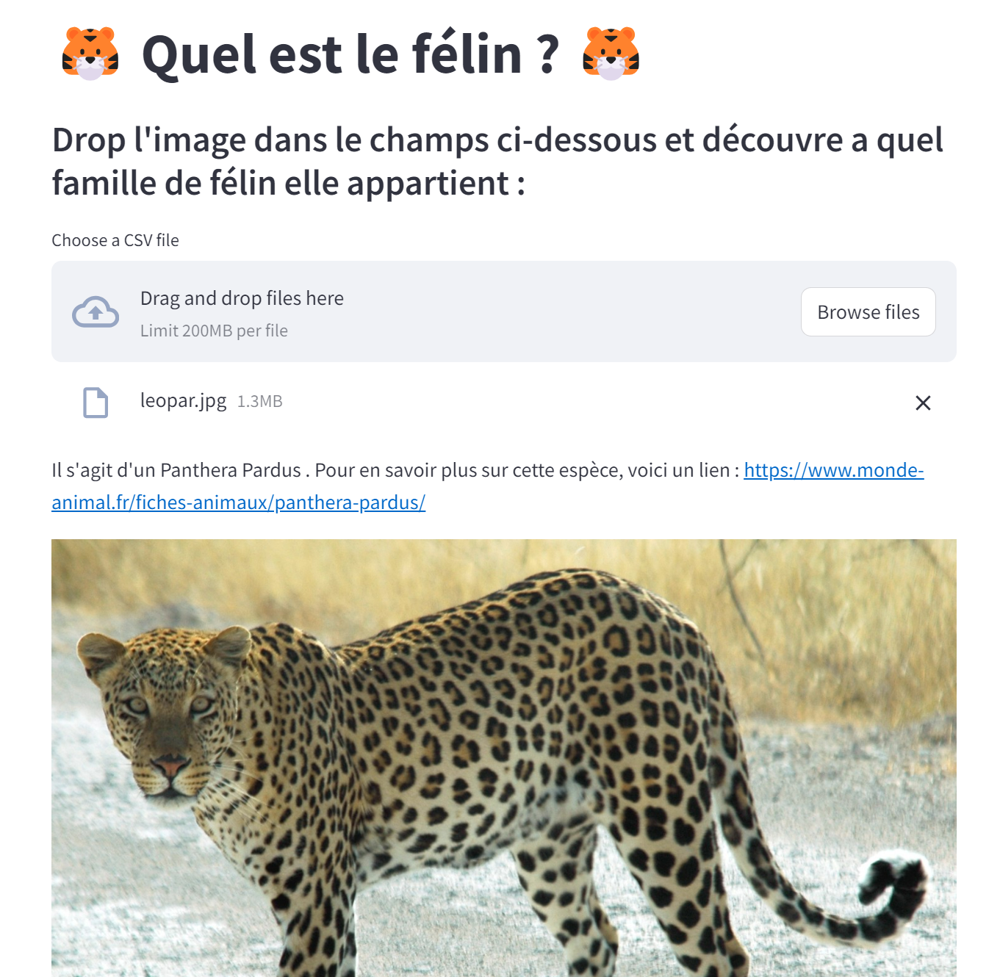

# Felin Classifier 



## **Description**


Ce projet met à disposition une interface permettant de classifier une image de félin selon son espèce. 

La classification se fait selon 7 espèces de félin différentes. Parmi elles, nous retrouvons :
- l'*Acinonyx jubatus* ou guepard
- le *Neofelis nebulosa* ou panthère nebuleuse
- le *Panthera leo* ou lion
- le *Panthera tigris* ou tigre
- le *Panthera onca* ou jaguar
- le *Panthera pardus* ou leopard
- le *Puma concolor* ou puma

Lien vers le jeu de donnée :

## **User Guide**

### **Récupération du projet**

Tout d'abord verifiez que vous avez bien installé [Git](https://git-scm.com/) sur votre espace de travail afin de récupérer les fichiers.
Ensuite, clonez le dossier dans le répertoire souhaité en utilisant la commande [git clone](https://github.com/axelcoch/felin_classifier.git) afin d'avoir accès au répertoire.

```
$:~/> cd <WORKDIR>
$:~/<WORKDIR> > git clone https://github.com/axelcoch/felin_classifier.git
$:~/<WORKDIR> > cd felin_classifier/
```

<br>

### **Lancement du projet**

Mettez-vous sur un environnement virtuel et assurez-vous d'installer les bonnes libraries et ensuite lancez le projet streamlit : 

```
$:~/<WORKDIR> > pip install -r requirements.txt
$:~/<WORKDIR> > streamlit run main.py
```

<br>

<!-- ### **Composition du projet et liste des technologies utilisés**

Le projet est composé de 2 fichiers python :
* *nba_sciping.py* afin de récupérer les données et de les pousser dans notre base de données.
* *dashboard.py* afin d'afficher les données dans un dashboard intéractif.

Pour le scraping de données, nous avons utilisé :
* *requests* afin de faire nos requetes html (requêtes GET).
* *beautifulsoup* (bs4) afin de parser le code que l'on a récupéré.

Pour le traîtement et le stockage des données :
* *pandas* pour stocker nos données dans un dataframe afin de les traiter un peu.
* *mongodb* afin de stocker nos données transformées dedans pour les réutiliser plus tard.
  
Pour l'affichage des données :
* *Dash* afin de créer un dashboard intéractif.
* *Plotly express* afin de faire de mettre les données sous forme de graphique. -->

 
<br>

